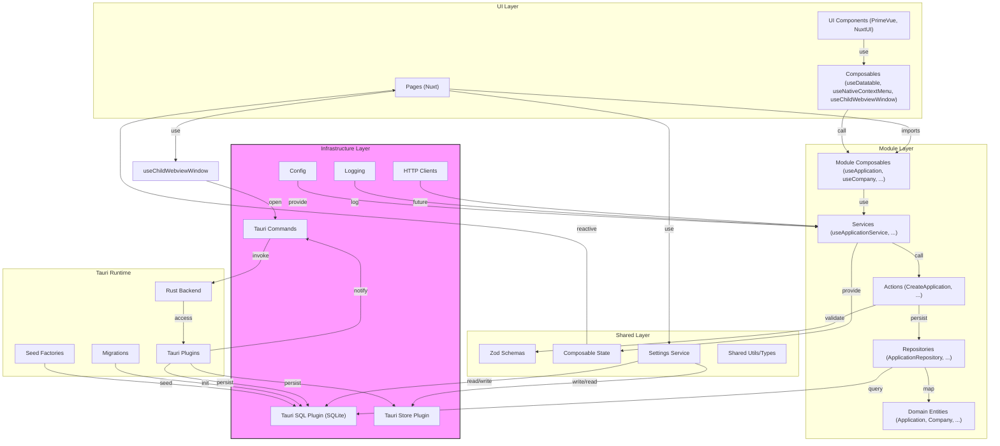
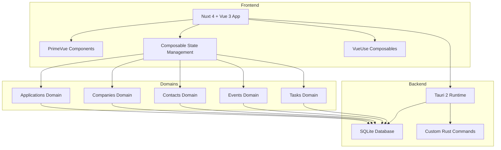

# Apply-Flow

Desktop-first job application tracking built with Nuxt 4 + Vue 3 + TypeScript inside a Tauri 2 runtime.

Last updated: 2026-05-19.

## System Architecture Overview

The following diagram shows the high-level interactions between the main layers and elements of the app, including UI, modules, shared logic, infrastructure, and Tauri runtime:



## Product Goal

This app is designed to manage the full job search lifecycle in one place:

- track every application from saved to outcome
- manage company and recruiter context
- record events, reminders, and interview details
- keep document versions linked to applications
- support local-first, offline-friendly workflows

## Domain Model (DDD-Oriented)

Recommended core domains for this project:

- Applications
- Companies
- Contacts
- Events / Timeline
- Tasks / Reminders
- Interviews
- Documents
- Communications
- Offers
- Analytics
- Profile
- Settings

Current MVP focus:

- Applications
- Companies
- Contacts
- Events
- Tasks
- Documents
- Search/Filters

## Feature Map

### Application Tracking

- title, company, status, date applied, source/platform
- job advert URL and snapshot path
- salary/rate, contract type, location/work mode
- notes, priority, tags, archive/delete flags
- duplicate detection key
- document linking (CV, cover letter, job spec, etc.)

Supported statuses in schema:

- saved
- applied
- recruiter_contacted
- screening
- technical_test
- interviewing
- offer
- rejected
- withdrawn
- accepted
- ghosted

### Company Management

- company profile, website, LinkedIn, Glassdoor
- industry, size, location
- notes, culture notes, benefits, tech stack
- rating/score and red flags
- contacts linked to company

### Contact / Recruiter CRM

- recruiter / hiring manager / interviewer / other
- email, phone, LinkedIn URL, agency relationship
- notes and follow-up context

### Event Timeline

- timestamped events per application
- event type, description, related contact
- optional attachment path
- reminder date and outcome

### Tasks & Reminders

- follow-up tasks, prep tasks, deadlines
- completed/pending state
- reminder timestamps and priority

### Document Management

- CV and cover letter versions
- technical test files and job descriptions
- certificates/references/other docs
- many-to-many link from documents to applications

### Notifications (Current Focus)

High-value reminders and alerts:

- interview reminders
- follow-up reminders
- recruiter response reminders
- offer deadlines
- stale application reminders
- sync/queue completion notifications

## Data Ownership Strategy

### SQLite (Persistent Business Data)

Use SQLite for durable domain data and auditability:

- applications
- companies
- contacts
- interviews
- reminders
- notes
- activity logs
- audit history
- offline queues

### Composable Local State (Ephemeral UI State)

Use component/composable-local refs/reactive state for view interaction state:

- sidebarOpen
- selectedApplicationId
- tableLayout
- splitPaneWidth
- activeTab
- filters
- sortDirection

### Service + Repository Data Flow

Use service classes and repositories for query/mutation orchestration.

### Tauri Store

Use Tauri Store for lightweight preferences/settings, not core business records.

### Tauri Rust State vs Frontend State

Use Rust-managed Tauri state for backend/native process state and long-running services:

- database handles
- notification scheduler
- background sync services
- search index worker
- app config/secrets/handles

Use composables (`ref`, `reactive`, `computed`) for frontend interaction state and UI composition.

## Domain Events (Examples)

- ApplicationCreated
- InterviewScheduled
- ReminderDue
- OfferReceived
- FollowUpNeeded

## Current Database Implementation

Schema management is external to this repository. The app connects to `sqlite:applyflow.db` through the Tauri SQL plugin.

Current tables include:

- applications
- tasks
- job_sources
- companies
- company_contacts
- tags
- application_tags
- application_events
- application_tasks
- documents
- application_documents

## Seed Data and Factories

Deterministic factories (one file per table) are in `src-tauri/factories`.

- mock data generation uses `@faker-js/faker`
- seed runner uses `better-sqlite3`
- rows are deleted and inserted in FK-safe order
- default target database URL: `sqlite:applyflow.db`

Run seed script:

```bash
npm run db:seed
```

Optional overrides:

```bash
DATABASE_URL=sqlite:applyflow.db SEED=20260518 npm run db:seed
```

## Stack

- Nuxt 4
- Vue 3
- TypeScript
- Tauri 2
- Service classes + repositories + composables
- PrimeVue + Nuxt UI + Tailwind CSS 4
- vee-validate + Zod
- Vitest + Vue Test Utils

## Tauri Plugin Capabilities (Initialized)

- SQL (SQLite)
- Notification
- Store
- Dialog
- FS
- Shell
- Log
- Opener
- Updater
- Window State

## Development Commands

```bash
npm install
npm run dev
npm run tauri dev
npm run build
npm run preview
npm run lint
npm run typecheck
npm run test:run
npm run test:coverage
npm run db:seed
```

## Nuxt Dev Stability

To reduce page reloads during development, Vite dependency pre-bundling is configured in `nuxt.config.ts`.

Current pre-bundled packages:

- `@tauri-apps/api/core`
- `@tauri-apps/api/dpi`
- `@tauri-apps/api/menu`
- `@tauri-apps/plugin-dialog`
- `@vue/devtools-core`
- `@vue/devtools-kit`

## Project Structure

```txt
src/                # Nuxt app source
src/shared/         # Shared domain/types/ui/utils/settings
src/infrastructure/ # Integrations and adapters
src/services/       # App-level services (including DB client abstractions)
src-tauri/          # Rust runtime, capabilities, factories
tests/              # Unit/component/integration tests + fixtures/mocks
```

## Development Observability (Recommended)

- Tauri devtools auto-open
- Vue Devtools
- SQL query logger
- domain event logger
- notification logger
- offline queue inspector

## Architecture Notes by Area

- [src/README.md](src/README.md)
- [src/shared/README.md](src/shared/README.md)
- [src/shared/settings/README.md](src/shared/settings/README.md)
- [src/infrastructure/README.md](src/infrastructure/README.md)
- [src/server/README.md](src/server/README.md)
- [src/pages/README.md](src/pages/README.md)
- [src/components/ui/README.md](src/components/ui/README.md)
- [src-tauri/README.md](src-tauri/README.md)
- [tests/README.md](tests/README.md)
- [tests/unit/README.md](tests/unit/README.md)

## Application Interaction Diagram



This diagram illustrates the interaction between the frontend, backend, and core domains of the application.

## Development Commands

Use this from the project root in PowerShell:

```bash
cargo clean --manifest-path Cargo.toml
```

For a fuller clean (Rust + Nuxt/Vite cache), run:

```bash
Remove-Item -Recurse -Force .\src-tauri\target, ..nuxt, .output -ErrorAction SilentlyContinue
```
